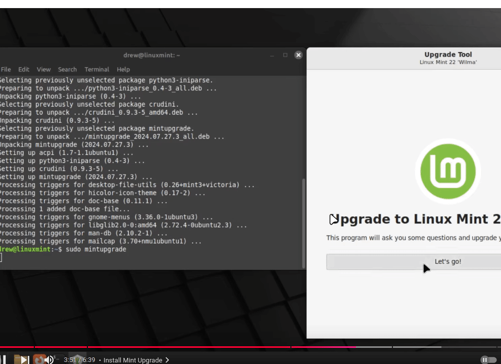
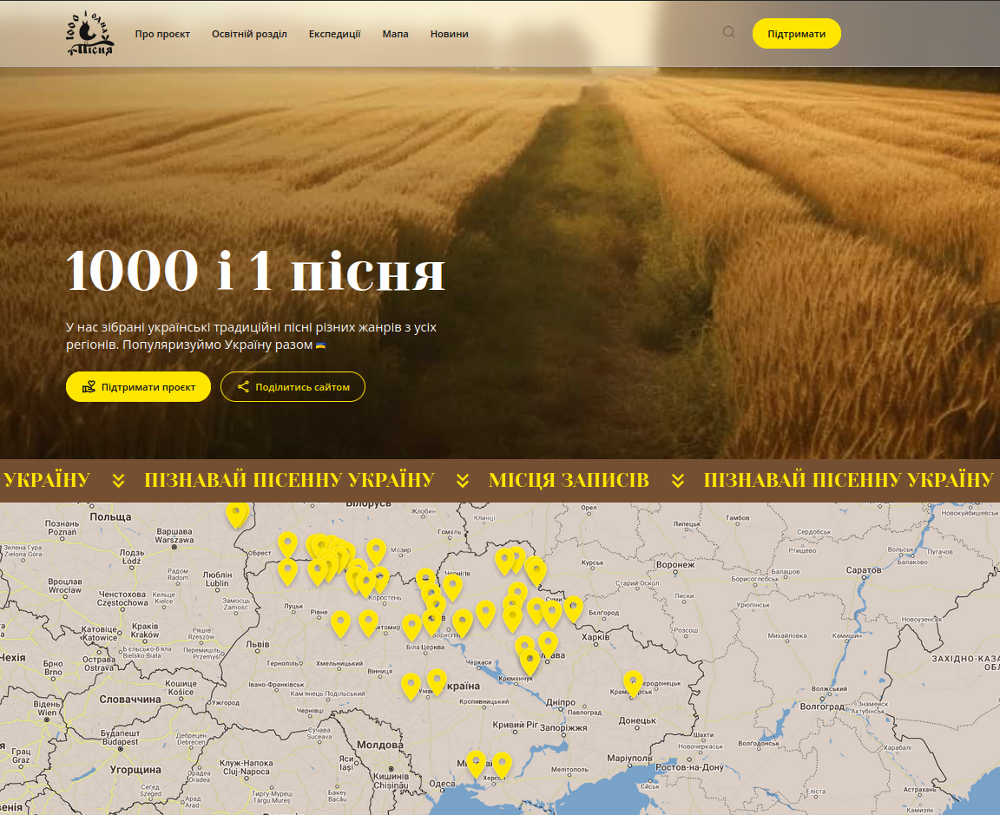
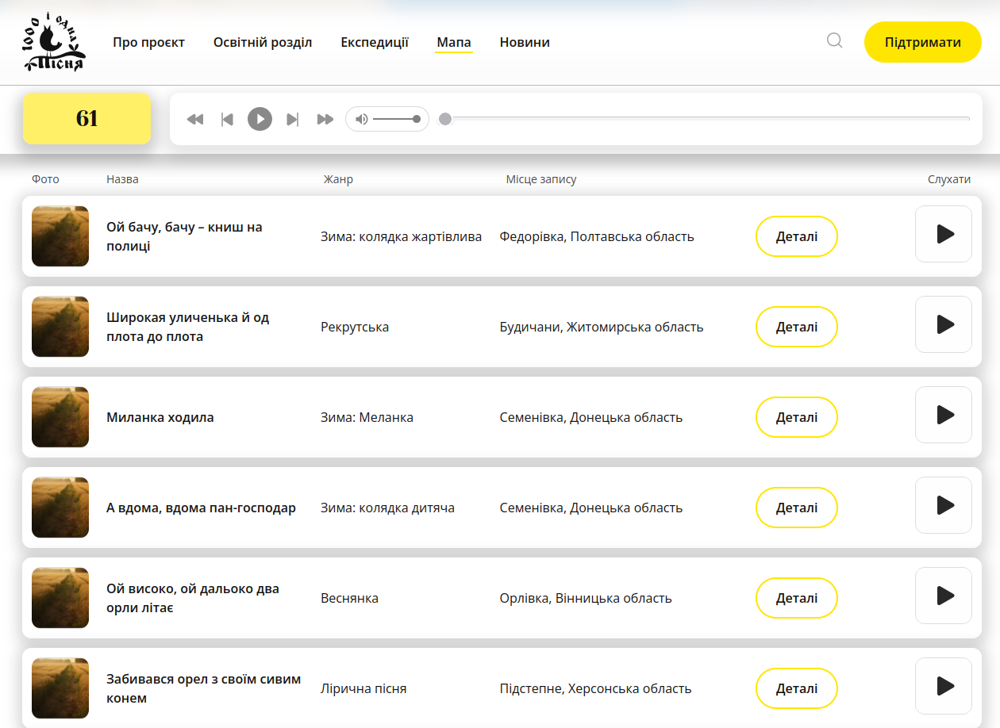

### 1000 and 1 song
We have collected Ukrainian traditional songs of various genres from all regions. Let's popularize Ukraine together

### Automated checking of all available application pages. The basis for this is filling the pages with elements according to the Figma layouts.
#### I automated the API part according to the requests specified in the Swagger documentation. I checked for the presence of appropriate keys in the response body.

#### Autotesting: 
* OOP
* API 
* functional
* regression UX
* load

#### Added reporting for convenience

